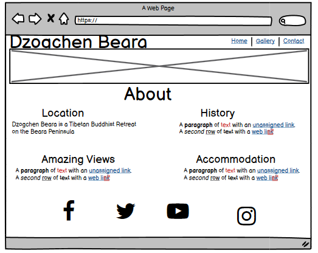
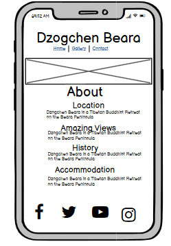
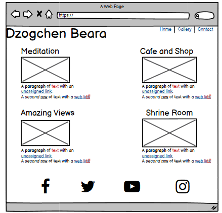
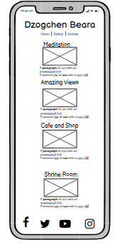
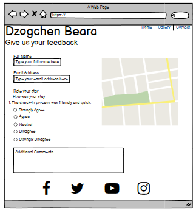
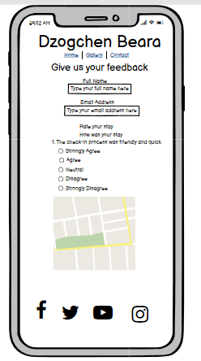

# Dzogchen Beara
Welcome!
# Introuduction
Dzogchen Beara is a website desgined for Tibetan Buddish Retreat centre on the wild atlantic way.  Dzogchen Beara is part of Rigpa, an international network of Buddhist centres dedicated to making the Buddhist teachings of meditation, compassion and wisdom available to the modern world. The site provies information about the centre and things you can do there. The main aim of this project is to incourage people to vist Dzoghen Beara and to get vital feedback on their stay.The site is targeted to people who are looking to go on a retreat and to get a break from thier busy and hectic lives. 

A live website can be found here

 
# Table of Contents
[1. User Expereince](#ux)
[Site skeleton (wireframes)](#wireframes)
 - [Introduction page](#introduction-page)
    -[Gallery page](#gallery-page)
    - [Feedback page](#feedback-page)

[2. Features](#features)

# 1. User Experience
Most adults at some stage might feel stressed or under pressure during their busy days. Perhaps some have anxious feelings and something worries can develope at certain time in thier life.

Users of this site will gain information about the retreat and what you can do there like medidate and get rid of all there stress and worry. The site also has a link in it for book to book a stay at the retreat.

The user can also navigate through the site easily, understand the information being presented, give feedback on there stay and view the websites cleary on different devices.

## 1.2 Site Skeleton
[Balsamiq](https://balsamiq.com/) was used to create wireframes of the website. This was very useful as it gives the template of the UI. Wireframes were designed for web browser and a mobile browser format. The concept design (wireframes) of webpages prepared is presented below.

### Home Page

### Gallery Page

### Feedback Page

 
# 2. Features
(#table-of-contents)

### Home page:
-A picture of the temple looking across the ocean is displayed just below the title.
-The page contains the title "About" by which is divied into four divisions. The first being the locationand the community, The second being spiritual, third being the history of the locality and the fourth being the accommdation with a link to the page where can book a stay.

### Gallery page:
-The gallery page just has the title Dzogchen Beara and is again divided into four sections with pictures.
-The first is "Medidation" with image of people medidiating and the benefits of medidiating, second is "Amazing views" with image of the centre overlooking the altanic ocean, third which is the "Cafe and Shop" image of the shop and opening times, and the fouth being "Shrine Room" image of people medidiating in the shrine room and information about the room.

### Feedback page
-The feedback pages includes the ability to message the retreat, provide feedback and suggestions. 
-Includes giving a rate on your stay forms where users can choose the options from (strongly agree, agree, neutral, disagree, strongly disagree) using radio-button option.
- The Submit and Reset buttons with hoever effect on it
- The form use the method="POST" action="https://formdump.codeinstitute.net/"
- I use the option of placeholder for full name and email address.

# 3. Technologies Used

* [HTML5](https://en.wikipedia.org/wiki/HTML5) (markup language) was used for structuring and presenting content of the website.
 * [CSS3](https://en.wikipedia.org/wiki/CSS) (Cascading Style Sheets) was used to provide the style to the content written in a HTML.
* [Balsamiq](https://balsamiq.com/) was used to create wireframes of the website (desktop and mobile version).
* [Google Fonts](https://fonts.google.com/) was used to import font-family "Playfair" and "Roboto" into style,css file and which was used throughout the pages of the website.
* [Font Awesome](https://fontawesome.com/) was used to improt icons to the sites.
* [Chrome](https://www.google.com/intl/en_uk/chrome/) was used to debug and test the source code using HTML5 as well as to test site responsiveness.
* [Github](https://github.com/) was used to create the repository and to store the project's code after pushed from Git.
* [Gitpod](https://www.gitpod.io/) was used as the Code Editor for the site